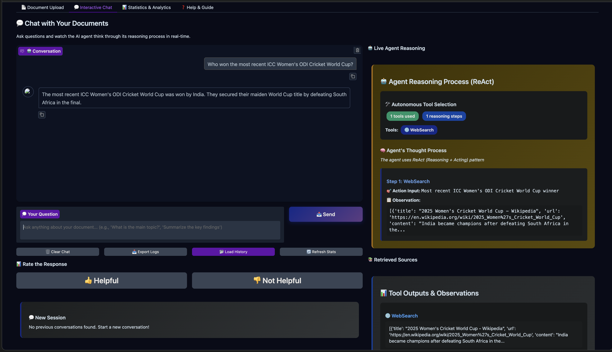
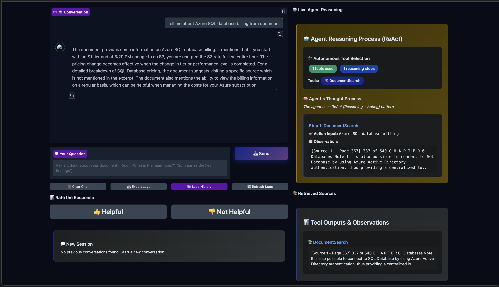

# 🚀 AI ChatBot

A modern, full-stack AI-powered ChatBot application with a beautiful Gradio frontend and python backend.

## 🚀 Quick Start

### Prerequisites

- Python 3.8+
- OpenAI API key

### Installation

1. **Clone and navigate to the project:**
   ```bash
   cd /path/to/chatbot
   ```

2. **Install dependencies:**
   ```bash
   pip install -r requirements.txt
   ```

3. **Set up environment variables:**
   ```bash
   cp env.example .env
   # Edit .env file and add your OpenAI API key
   ```

4. **Start Application:**
   ```bash
   python start_services.py
   ```


## Working examples

#### PDF processed successfully


#### WebSearch Tool call




#### Document search Tool call


